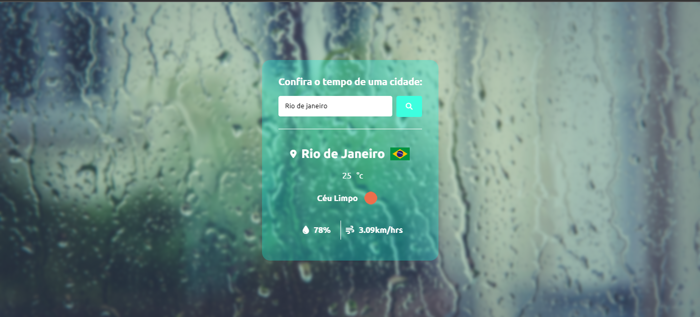

# Mundo-clima
 
## autor

 - Projeto inspirado em projeto do matheus batistt
 - feito por Alexandre gabriel
## funcionalidades:

 - Visualização da temperatura e clima em todos os locais do mundo.
## Como Contribuir

Este projeto é de código aberto e aceita contribuições da comunidade. Se você deseja colaborar, siga os passos abaixo:

1. Faça um fork do repositório.
2. Clone o seu fork: `git clone https://github.com/seu-usuario/mundo-clima.git`
3. Crie uma nova branch para as suas modificações: `git checkout -b feature/nova-feature`
4. Faça as suas alterações e commit: `git commit -m "Adiciona nova feature"`
5. Envie as suas alterações para o seu repositório no GitHub: `git push origin feature/nova-feature`
6. Faça um pull request para o repositório original.

## Tecnologias Utilizadas

- HTML5
- CSS3
- sass

## imagens do projeto

